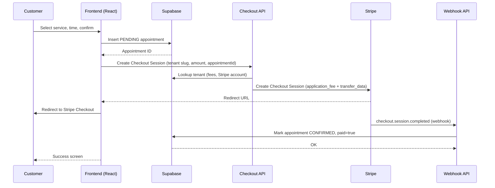

### VantakOS White Paper

## Executive summary
- **What**: VantakOS is a multi-tenant, white‑label PWA platform for local service businesses delivering branded booking, payments, and an owner command center out‑of‑the‑box.
- **How**: Per-tenant resolution drives live branding, app manifest, and payment routing. Bookings complete via Stripe Connect with application fee splits; webhooks confirm appointments. Owners manage branding and payouts in a Command Center with an AI assistant.
- **Why**: Launch a fully branded, installable app with integrated booking and payouts in hours—no app store, and a “pay when you get paid” model.

## Product overview
- **Audience**: Service SMBs (salons, spas, studios, clinics) and multi-brand operators.
- **Value proposition**: One platform to launch a branded mobile experience, accept payments, and manage operations without heavy engineering.
- **Pricing model**:
  - Starter: 1.5% fee
  - Pro: 1.0% fee
  - Elite: 0.4% fee

## Core capabilities
- **White-label branding**: Live CSS variable injection and per-tenant PWA manifest.
- **Installable mobile app (PWA)**: “Add to Home Screen” flows for iOS/Android; dynamic, tenant-specific manifest.
- **End-to-end booking**: 3-step flow creates a pending appointment and redirects to Stripe Checkout.
- **Multi-tenant payments**: Stripe Connect accounts per merchant, application fees to Vantak, transfers to merchant.
- **Owner Command Center**: Branding editor, payout connection, basic financial metrics, and integrated AI support.
- **Prospector Engine**: One-click creation of demo tenants (with logo discovery) for rapid sales and preview links.

## Architecture
The platform is a React SPA with Next-style API routes, Supabase as the “Truth Database,” and Stripe Connect for payments. Tenant context is resolved at startup and applied across theming, routing, and payments.

```mermaid
flowchart LR
  A[Customer Browser] --> B[Resolve Tenant (slug/query)]
  B --> C[Inject Theme (CSS vars)]
  C --> D[Landing / Service List]
  D --> E[Booking Flow]
  E --> F[Create PENDING Appointment (Supabase)]
  F --> G[Checkout API (Next route)]
  G --> H[Stripe Checkout (Connect)]
  H --> I[Stripe Webhook]
  I --> J[Confirm Appointment (Supabase)]
  J --> K[Owner Dashboard (Branding/Payments)]
  C --> L[Dynamic Manifest (PWA Install)]
```

## Multi-tenancy and theming
- Tenants are resolved from a `tenant` query parameter (or subdomain mapping in Next) and read from Supabase. A fallback mock exists for resilience.
- Branding is applied via CSS variables for colors, fonts, and theme color meta tags; Tailwind consumes these variables for live retheming.

## Payments and monetization
- Each merchant completes Stripe Connect onboarding to link their bank account.
- Checkout sessions compute an application fee (platform revenue share) and transfer the remainder to the merchant’s connected account.
- Stripe webhooks verify successful checkout and mark appointments as paid/confirmed in Supabase.

## PWA distribution
- The app injects a tenant-specific web app manifest at runtime to provide per-tenant name, theme color, icons, and start URL.
- Custom install banners nudge users to add the app to their home screen on iOS/Android.

## Booking experience
- A guided 3-step UI:
  1) Select a service
  2) Pick date/time
  3) Confirm and pay
- On confirmation, a pending appointment is created in Supabase. The app calls the secure checkout API and redirects to Stripe Checkout. On success, webhooks confirm the appointment.



## Owner Command Center
- Tabs for overview, schedule, financials, branding, and settings.
- Branding editor updates theme live and persists to Supabase.
- Payment settings connect Stripe or open the Stripe dashboard via secure login links.
- “Vantak Guide” (AI assistant) answers tenant-aware questions concisely with guardrails.

## Prospector Engine (sales enablement)
- Rapidly creates demo tenants (with Clearbit logo discovery), seeds configuration, and generates a `/preview?tenant=...` link for personalized demos.
- Helps sales teams share a live, branded experience in minutes.

## Data model (selected)
- `TenantConfig`: canonical brand and financial configuration (colors, font, fee percent, Stripe account ID, etc.).
- `Service`: services offered per tenant (name, price, duration).
- `Appointment`: booking state machine (PENDING → CONFIRMED via webhook).

## Security and compliance
- Stripe Connect isolates merchant funds and platform fees; sensitive actions (onboarding, login links, webhooks) run server-side.
- Supabase service role keys should remain server-only; enforce RLS in production.
- Recommendation: store all secrets in environment variables and prohibit client exposure.

## Deploy and configuration
- Local run
  - Prereqs: Node.js
  - Install: `npm install`
  - Dev: `npm run dev`
  - Environment (examples): `NEXT_PUBLIC_SUPABASE_URL=YOUR_SUPABASE_URL`, `SUPABASE_SERVICE_ROLE_KEY=YOUR_SUPABASE_SERVICE_ROLE_KEY`, `STRIPE_SECRET_KEY=YOUR_STRIPE_SECRET_KEY`, `STRIPE_WEBHOOK_SECRET=YOUR_STRIPE_WEBHOOK_SECRET`, `NEXT_PUBLIC_URL=http://localhost:3000`, `API_KEY=YOUR_API_KEY`
- Hosting
  - Serve the SPA and Next-style API routes.
  - Configure Stripe webhooks to point to `/api/webhooks/stripe`.
  - Ensure Supabase URL/keys are correctly set in server environment.

## Operator workflow (how to use)
1. Create a demo tenant at `/admin/prospector` to generate a personalized preview.
2. Share the `/preview?tenant=slug` link with the prospect.
3. Prospect claims via `/claim` and completes Stripe onboarding to link payouts.
4. Configure branding in “Branding DNA” and publish.
5. Connect Stripe or open the merchant dashboard from “OS Settings.”
6. Seed services (Supabase-backed in production).
7. Customers book and pay; webhooks confirm appointments automatically.
8. Customers install the PWA for fast re-engagement.

## Roadmap highlights
- Advanced scheduling (staff calendars, resources).
- Inventory and shop enablement where allowed.
- Expanded analytics and insights.
- Automated custom domain / subdomain routing beyond query params.


